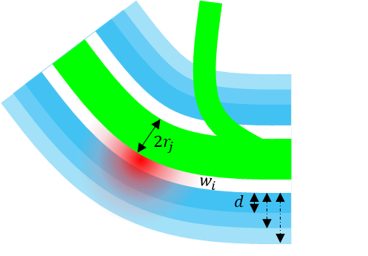

# REAVER for BBB opening
Rapid Editable Analysis of Vessel Elements Routine, utilized for quantification of perivascular EB extravasation during BBB opening.

## Dependencies:
* Tested on MATLAB 2021a, requires image processing toolbox.
* Before starting the process make sure the control and test tiff files are placed in seperate folders

## Initialization
1. Open the extracted folder in matlab and run the main app by executing:
	>EBreaverApp

in the MATLAB command terminal. 
The following window will pop-up:

## Vessel segmentation
1. Open the REAVER GUI via the dedicated push button
2. Follow the *[REAVER segmentation pipeline](https://github.com/uva-peirce-cottler-lab/public_REAVER)*
- Use the FITC-dextran (green) channl for segmentation
- This will create a ".mat" file for each segmented tiff file
- It will also create a "UserVerified.mat" file that points to verified files for future analysis

## Batch analysis of segmented images
1. Choose control file directory and test file directory.
- These should contain the already segmented tiff files
2. Specify the perivascular width (d) and the distance from vessel wall (w_i) to fit your experiment:

3. Check the "normalize red" checkbox to perform frame-level normalization of the red channel to a range of [0,1]
4. Press the process folders push button
- This will create an "EB_analysis_<hyper_parameters>.mat" file in each of the directories
- The created file name indicated the analysis hyper-parameters

## Create a summary object
1. Press the "Create analysis object" push button
2. Choose the approperiate EB_analysis file from the control directory
3. Choose the appropriate EB_analysis file from the test directory
- This will generate a summary object of class "EB_analysis" and save it to the open matlab workspace as "results"

The EB_analysis class object has the following plotting methods:

**scatterPlot**
Creates a scatter plot where each point represents a vessel segment and the axis are:
x = vessel diameter, y = Median red intensity in perivascular area 
The control and test measurements are marked with different colors

**fitplot**
Creates two lines on a single plot, one for control and one for test data.
Each line represents the median red intensity in perivascular area as function
of the diameter with error bars.
The lines are also fitted with an equation based on the user-specfied model (e.g. linear/quadratic)

**violinplot**
Implements a violin plot for control and test data side-by-side for the specified diameter groups.
>Bechtold, Bastian, 2016. Violin Plots for Matlab, Github Project
https://github.com/bastibe/Violinplot-Matlab, DOI: 10.5281/zenodo.4559847

**barplot**
creates a bar plot for the specified diameter groups.
optional flag for which class groups to plot (1 = test, 2 = control and test, 0 = subtraction, -1 = control)

**redDistrebution**
Plots the distribution histogram of red intensity in perivascular area for control and test groups.
The histograms are plotted seperately for each diameter group specified.
The histograms can be plotted with or without a line indicated number of SDs above the control mean
The histogram can be plotted as bar histogram or as 'psd' by applying a kernel density

**diamHist**
Plots the histogram of diameters of all segmented vessels. Also adds a comparison (2-way ANOVA) between control and test distributions.

**openedHist**
plots the fraction of opened vessels in different diameters of vessels (in specified diameter groups)
Also returns a table of opening percentage per frame and diameter for statistical analysis in GraphPad

**regionHistogram**
plots the number of vessels in each treated brain by brain region (beta version)

## Other EB_analysis class methods

**subarea**
Create a new EB_analysis object with vessels only from a user specified brain region

**writecsv**
Write the summary table into 2 csv objects (control and test) for GraphPad analysis

**keep_diameters**
Remove all vessels with diameters outside the specified thresholds

**match_histogram**
Create a new EB_analysis object where for each diameter group the extreme vessels are removed
from the group with more vessels (control or test) to eliminate class imbalance
